# 视频景点汇总 · 带图评价版

> **看图：** 源码页不会出图。请按 `Ctrl+Shift+V` 开 Markdown 预览；若仍空白，双击打开同目录的 `02-视频景点汇总.html`（浏览器一定能看图）。  
> 素材来自《韩国旅游视频攻略1》。推荐度按你们行程重评（2 人情侣 · 约 2.5 天 · 穷游但吃可略好），不是照搬博主榜。  
> 封面在英文目录 `covers/`；原截图在 `视频解析/景点/`。

## 一览（按推荐度）

| 推荐 | 景点 | 标签 | 时长 | 一句话 |
|------|------|------|------|--------|
| ★★★★★ | 广藏市场 | 必去·吃 | 1–1.5h | 穷游但想吃好：这里性价比天花板。 |
| ★★★★★ | 弘大入口商圈 | 必去·氛围 | 2–3h（含夜） | 年轻人街道、街头表演、文创与平价潮店，夜生活不贵也好逛。 |
| ★★★★★ | 景福宫 | 必去·文化 | 2–3h | 首尔最值得的宫殿体验：规模大、仪式感强。 |
| ★★★★★ | 汝矣岛汉江公园 | 必去·日落 | 1–1.5h | 免费浪漫：野餐垫、骑行、看汉江日落。 |
| ★★★★★ | 益善洞韩屋村 | 必去·氛围 | 1–1.5h | 比北村人少、咖啡和小店更好逛，情侣感更强。 |
| ★★★★☆ | 东大门（含DDP） | 强烈推荐 | 夜游1.5–2h | DDP 夜景建筑本身就值一趟；商圈可买可不买。 |
| ★★★★☆ | 光化门 | 顺路必打 | 20–40min | 景福宫正门广场，几乎零成本打卡。 |
| ★★★★☆ | 北村韩屋村 | 强烈推荐 | 1–1.5h | 韩屋巷经典，拍照好看；但游客多、部分巷弄像「打卡流水线」。 |
| ★★★★☆ | 圣水洞 | 强烈推荐 | 2h | 工业风咖啡与设计店，出片、不赶景点KPI。 |
| ★★★★☆ | 弘益大学 | 与弘大一体 | 含在弘大 | 校园本身一般，价值在周边商圈。 |
| ★★★★☆ | 德寿宫 | 强烈推荐 | 1–1.5h | 比景福宫小而精，石墙路+西式建筑混搭，夜景很出片。 |
| ★★★★☆ | 鹭梁津海鲜市场 | 强烈推荐·吃 | 1.5h | 现买现吃海鲜，烟火气足。 |
| ★★★☆☆ | COEX（星空图书馆） | 可选·室内 | 1–1.5h | 星空图书馆拍照 20–40 分钟够了；商场本身普通。 |
| ★★★☆☆ | N首尔塔 | 可选·夜景 | 2h+ | 情侣经典，日落+夜景确实浪漫；但缆车/门票不便宜，且排队吃时间。 |
| ★★★☆☆ | 乐天世界塔 | 可选·夜景替补 | 1h | 观景台现代、视野好；和 N 塔二选一。 |
| ★★★☆☆ | 国立中央博物馆 | 可选·雨天 | 2h+ | 免费、内容扎实，适合下雨或真正爱历史的人。 |
| ★★★☆☆ | 天空公园 | 季节限定 | 1.5h | 芒草季（约秋）很出片；过季就是普通山坡公园。 |
| ★★★☆☆ | 崇礼门 | 顺路看看 | 15–30min | 国宝城门，灯光好看，但停十分钟够。 |
| ★★★☆☆ | 延世大学 | 顺路可逛 | 45–60min | 校园漂亮，新村商圈可吃。 |
| ★★★☆☆ | 新沙洞林荫道 | 可选·散步 | 1–1.5h | 林荫路好看、适合散步拍照，但店偏精致消费。 |
| ★★★☆☆ | 明洞 | 可选·购物 | 1.5–2h | 美妆药妆方便，但小吃贵、游客雷区多。 |
| ★★★☆☆ | 梨泰院 | 可选·晚餐 | 夜2h | 国际餐吧多，氛围异国。 |
| ★★★☆☆ | 梨花女子大学 | 顺路可逛 | 45–60min | 红砖楼和校园拍照清新，但就是校园。 |
| ★★★☆☆ | 首尔林 | 可选·公园 | 1–1.5h | 大公园散步舒服、免费。 |
| ★★☆☆☆ | 63大厦 | 可跳过 | 1–1.5h | 观景台+水族馆偏「观光套餐」，性价比一般。 |
| ★★☆☆☆ | 乐天世界游乐园 | 可跳过 | 半天+ | 好玩但极耗时间与预算，吃掉你们 1/3 行程。 |
| ★★☆☆☆ | 建大中国街 | 可跳过 | 1h | 想家吃中餐可以，但专程去意义不大——你们从深圳出发，不必跑首尔吃中餐。 |
| ★★☆☆☆ | 汉阳大学 | 可跳过 | 40min | 学生街能吃，但不够独特。 |
| ★★☆☆☆ | 江南站商圈 | 可跳过 | 1–2h | 热闹但「国际大都市商圈」同质化，首尔特色不如弘大/北村。 |
| ★★☆☆☆ | 狎鸥亭 | 可跳过 | 1h | 时尚街，消费高，和清潭洞、新沙重叠。 |
| ★★☆☆☆ | 青瓦台 | 可跳过 | 1h+预约 | 有历史意义，但对短途情侣「好玩程度」一般，还要预约。 |
| ★☆☆☆☆ | 明知大学 | 建议跳过 | 40min | 短途性价比低，几乎纯校园。 |
| ★☆☆☆☆ | 清潭洞 | 建议跳过 | 1h | 奢侈品街，和预算风格不符。 |
| ★☆☆☆☆ | 首尔儿童大公园 | 建议跳过 | 2–3h | 亲子向。 |

## 建议怎么勾

- **★★★★★**：尽量塞进行程
- **★★★★**：很值得，看动线选 2–4 个
- **★★★**：顺路/替补/特定需求再去
- **★★ 及以下**：这次默认砍掉

---

## 详情（附图）

### 广藏市场　★★★★★　`想去：[ ]`

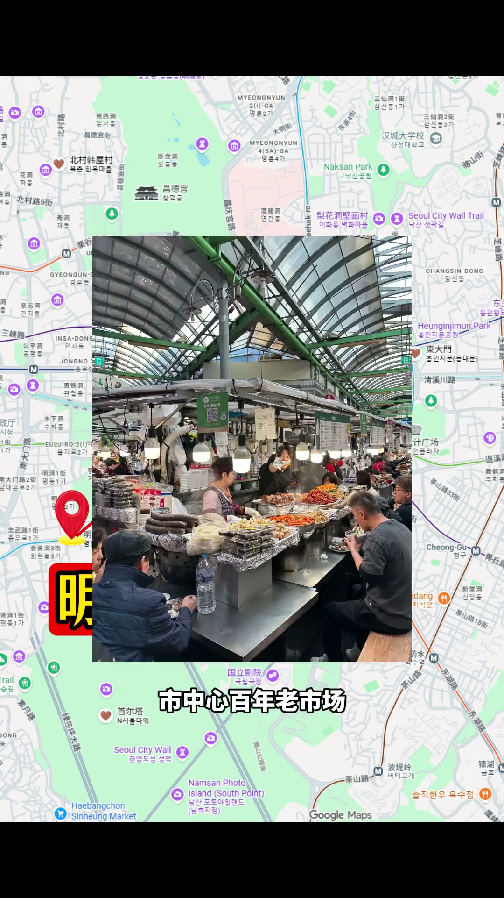

- **标签**：必去·吃　·　**建议时长**：1–1.5h
- **为什么（针对你们）**：穷游但想吃好：这里性价比天花板。药果、肉煎饼、刀切面、猪蹄摊烟火气足，比明洞小吃更「本地」。
- **Tips**：正餐来吃；避开极端饭点长队。和东大门/钟路可连线。
- **更多截图**：`视频解析/景点/16-广藏市场/`

---

### 弘大入口商圈　★★★★★　`想去：[ ]`

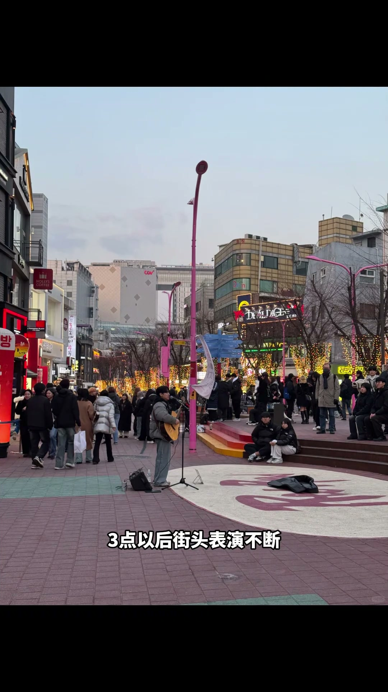

- **标签**：必去·氛围　·　**建议时长**：2–3h（含夜）
- **为什么（针对你们）**：年轻人街道、街头表演、文创与平价潮店，夜生活不贵也好逛。情侣短途很对味，比江南「贵」。
- **Tips**：下午到晚上最佳；和梨大/新村可拼一天。
- **更多截图**：`视频解析/景点/05-弘大入口商圈/`

---

### 景福宫　★★★★★　`想去：[ ]`

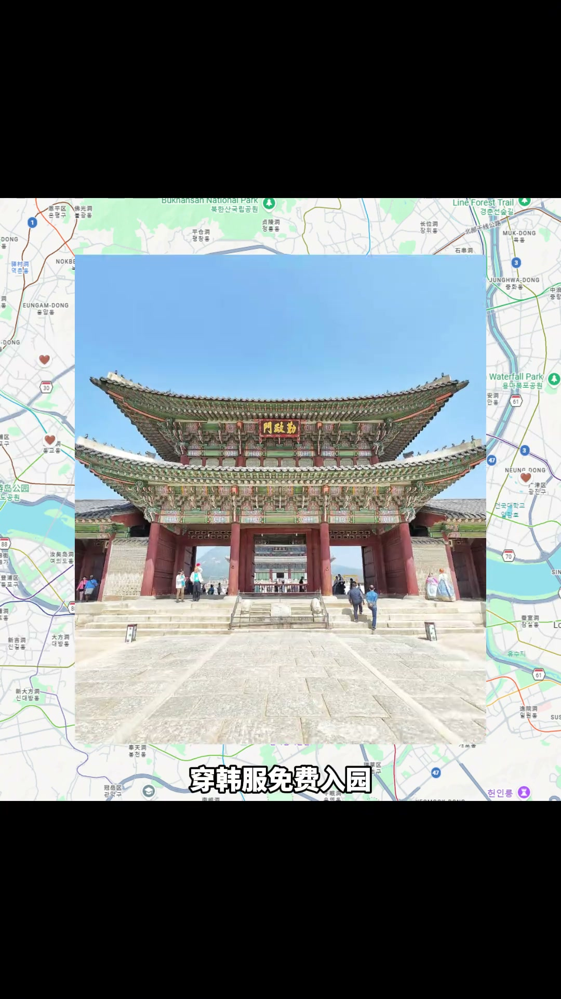

- **标签**：必去·文化　·　**建议时长**：2–3h
- **为什么（针对你们）**：首尔最值得的宫殿体验：规模大、仪式感强。穿韩服免费入园，情侣出片率极高。时间紧也能只走中轴主殿。
- **Tips**：尽量上午开门后人少；和北村/益善洞同天最顺。
- **更多截图**：`视频解析/景点/01-景福宫/`

---

### 汝矣岛汉江公园　★★★★★　`想去：[ ]`

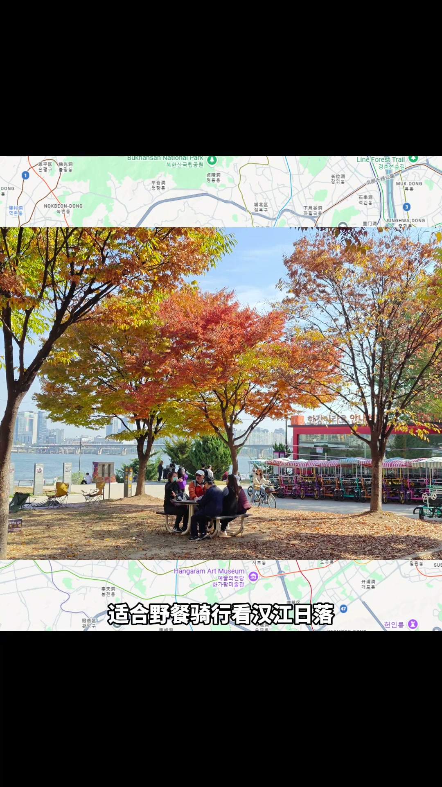

- **标签**：必去·日落　·　**建议时长**：1–1.5h
- **为什么（针对你们）**：免费浪漫：野餐垫、骑行、看汉江日落。住永登浦时几乎家门口；10月无彩虹喷泉也仍值得。
- **Tips**：傍晚去；便利店买点吃的即可。
- **更多截图**：`视频解析/景点/06-汝矣岛汉江公园/`

---

### 益善洞韩屋村　★★★★★　`想去：[ ]`

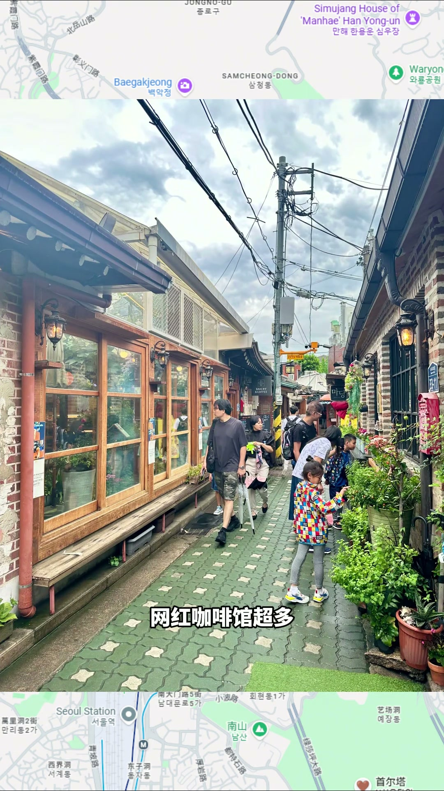

- **标签**：必去·氛围　·　**建议时长**：1–1.5h
- **为什么（针对你们）**：比北村人少、咖啡和小店更好逛，情侣感更强。你们「吃略好」预算很适合这里坐一间好看的咖啡店。
- **Tips**：建议取代「北村深度游」；和景福宫同天。
- **更多截图**：`视频解析/景点/13-益善洞韩屋村/`

---

### 东大门（含DDP）　★★★★☆　`想去：[ ]`

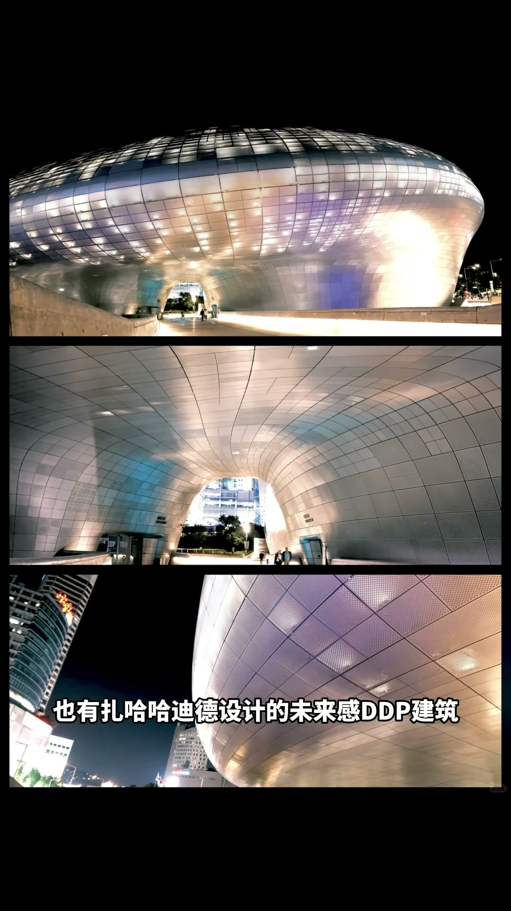

- **标签**：强烈推荐　·　**建议时长**：夜游1.5–2h
- **为什么（针对你们）**：DDP 夜景建筑本身就值一趟；商圈可买可不买。比 N 塔更省钱、更现代。
- **Tips**：夜景专程；批发楼可略过。
- **更多截图**：`视频解析/景点/07-东大门DDP/`

---

### 光化门　★★★★☆　`想去：[ ]`

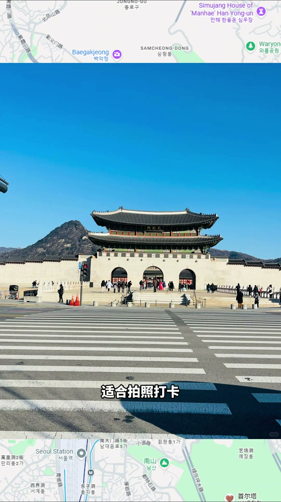

- **标签**：顺路必打　·　**建议时长**：20–40min
- **为什么（针对你们）**：景福宫正门广场，几乎零成本打卡。不单独专程，和宫殿打包。
- **Tips**：换岗仪式可看一眼。
- **更多截图**：`视频解析/景点/12-光化门/`

---

### 北村韩屋村　★★★★☆　`想去：[ ]`

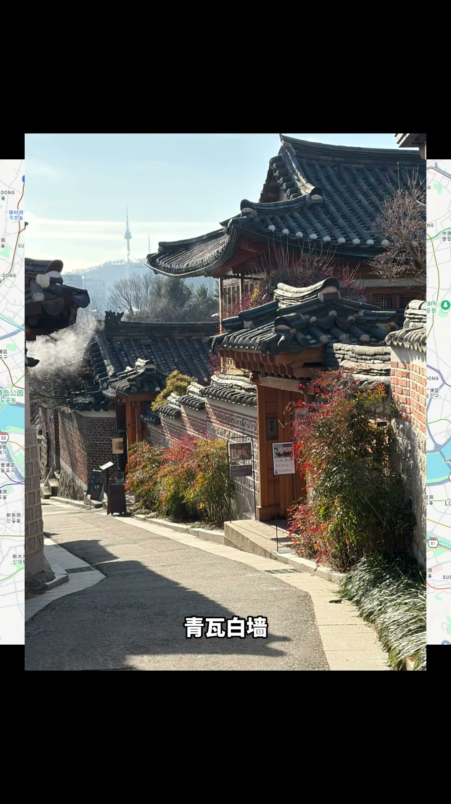

- **标签**：强烈推荐　·　**建议时长**：1–1.5h
- **为什么（针对你们）**：韩屋巷经典，拍照好看；但游客多、部分巷弄像「打卡流水线」。值得去，别排太久。
- **Tips**：想安静可主逛益善洞，北村只走观景台一带。
- **更多截图**：`视频解析/景点/02-北村韩屋村/`

---

### 圣水洞　★★★★☆　`想去：[ ]`

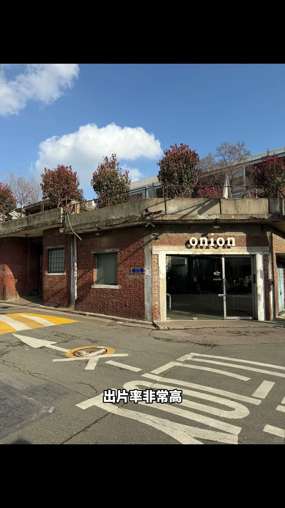

- **标签**：强烈推荐　·　**建议时长**：2h
- **为什么（针对你们）**：工业风咖啡与设计店，出片、不赶景点KPI。适合「慢半拍约会日」，比大学校园打卡有意思。
- **Tips**：可与首尔林连走；别排太满商场。
- **更多截图**：`视频解析/景点/25-圣水洞/`

---

### 弘益大学　★★★★☆　`想去：[ ]`

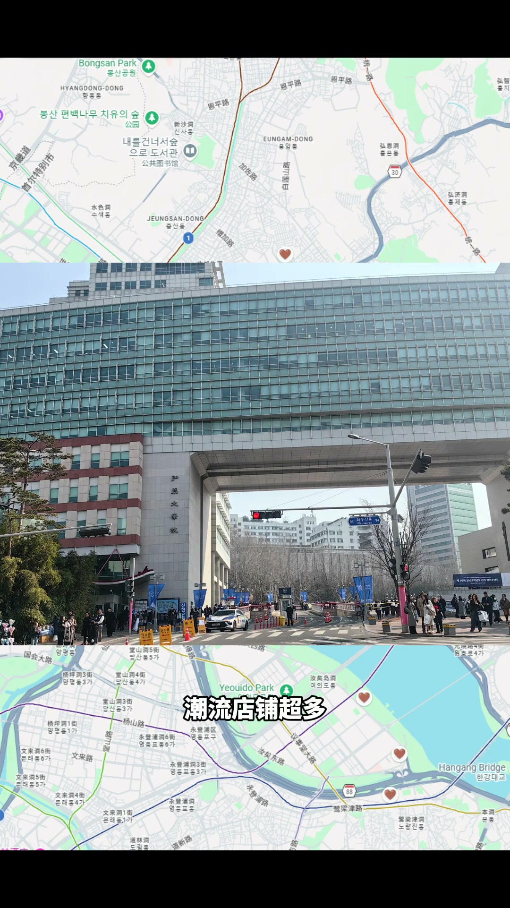

- **标签**：与弘大一体　·　**建议时长**：含在弘大
- **为什么（针对你们）**：校园本身一般，价值在周边商圈。算进「弘大」即可，不必单列KPI。
- **Tips**：当弘大的一部分逛。
- **更多截图**：`视频解析/景点/20-弘益大学/`

---

### 德寿宫　★★★★☆　`想去：[ ]`

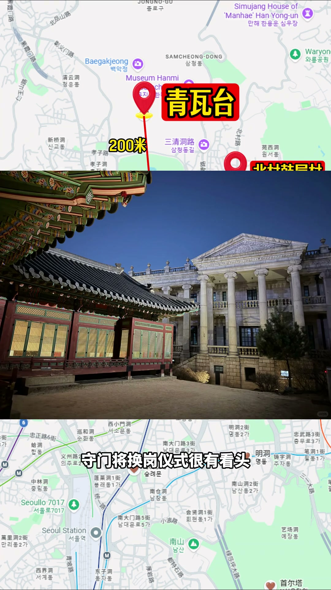

- **标签**：强烈推荐　·　**建议时长**：1–1.5h
- **为什么（针对你们）**：比景福宫小而精，石墙路+西式建筑混搭，夜景很出片。时间紧可「德寿宫夜景」替代第二个宫殿白天。
- **Tips**：傍晚进、天黑后出石墙路最佳。
- **更多截图**：`视频解析/景点/14-德寿宫/`

---

### 鹭梁津海鲜市场　★★★★☆　`想去：[ ]`

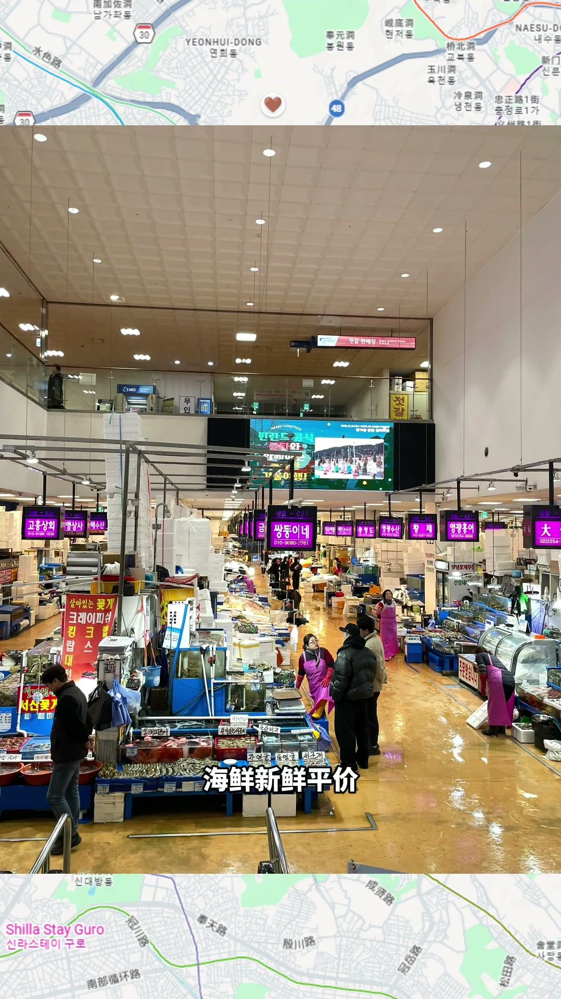

- **标签**：强烈推荐·吃　·　**建议时长**：1.5h
- **为什么（针对你们）**：现买现吃海鲜，烟火气足。吃可略好的预算很匹配；注意别被宰、先问价。
- **Tips**：一顿正餐；和汝矣岛可同区安排。
- **更多截图**：`视频解析/景点/33-鹭梁津海鲜市场/`

---

### COEX（星空图书馆）　★★★☆☆　`想去：[ ]`

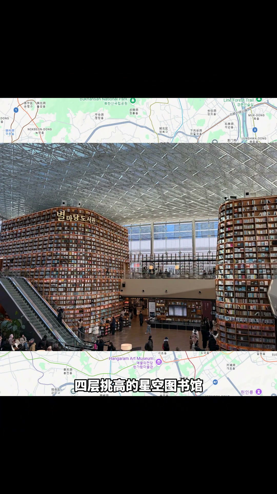

- **标签**：可选·室内　·　**建议时长**：1–1.5h
- **为什么（针对你们）**：星空图书馆拍照 20–40 分钟够了；商场本身普通。雨天/避暑备用，不当主菜。
- **Tips**：顺路三成站；别专程跨城只为图书馆。
- **更多截图**：`视频解析/景点/08-COEX星空图书馆/`

---

### N首尔塔　★★★☆☆　`想去：[ ]`

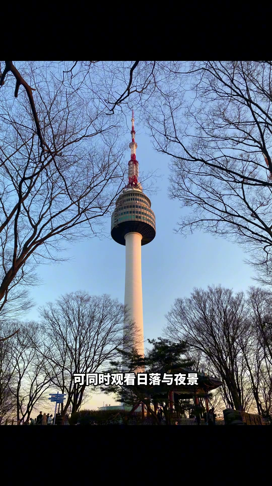

- **标签**：可选·夜景　·　**建议时长**：2h+
- **为什么（针对你们）**：情侣经典，日落+夜景确实浪漫；但缆车/门票不便宜，且排队吃时间。2.5 天里和乐天塔/汉江夜景互斥。
- **Tips**：若去：赶日落上山；不想花钱可只到南山公园看夜景。
- **更多截图**：`视频解析/景点/03-N首尔塔/`

---

### 乐天世界塔　★★★☆☆　`想去：[ ]`

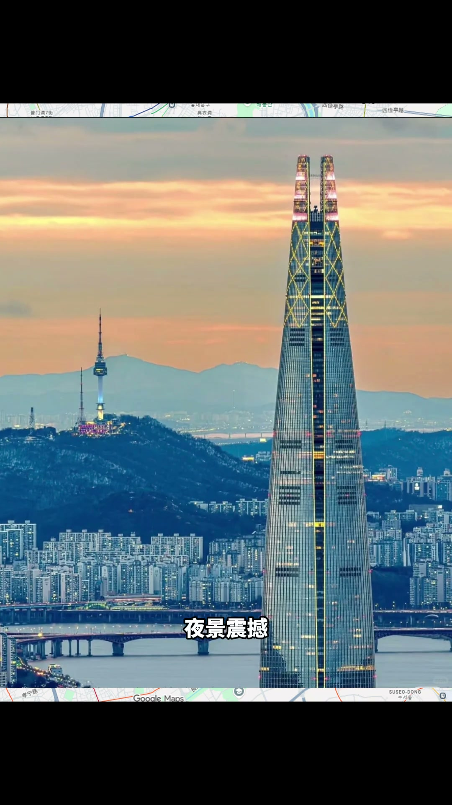

- **标签**：可选·夜景替补　·　**建议时长**：1h
- **为什么（针对你们）**：观景台现代、视野好；和 N 塔二选一。蚕室略偏，要算通勤。
- **Tips**：若不去南山，可考虑这里或免费汉江夜景。
- **更多截图**：`视频解析/景点/31-乐天世界塔/`

---

### 国立中央博物馆　★★★☆☆　`想去：[ ]`

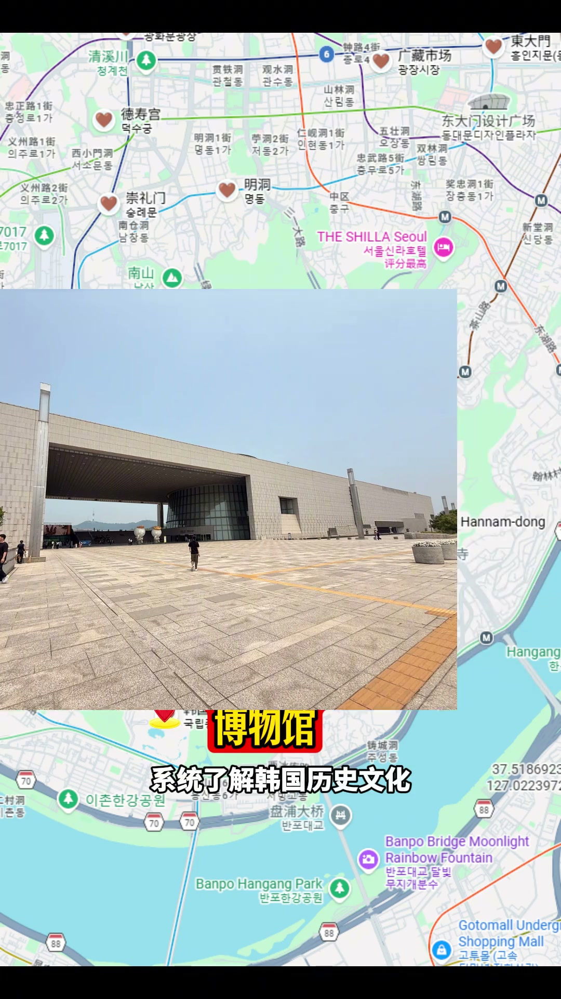

- **标签**：可选·雨天　·　**建议时长**：2h+
- **为什么（针对你们）**：免费、内容扎实，适合下雨或真正爱历史的人。你们节奏紧时不如户外好逛。
- **Tips**：雨备；不要和景福宫同天硬塞。
- **更多截图**：`视频解析/景点/17-国立中央博物馆/`

---

### 天空公园　★★★☆☆　`想去：[ ]`

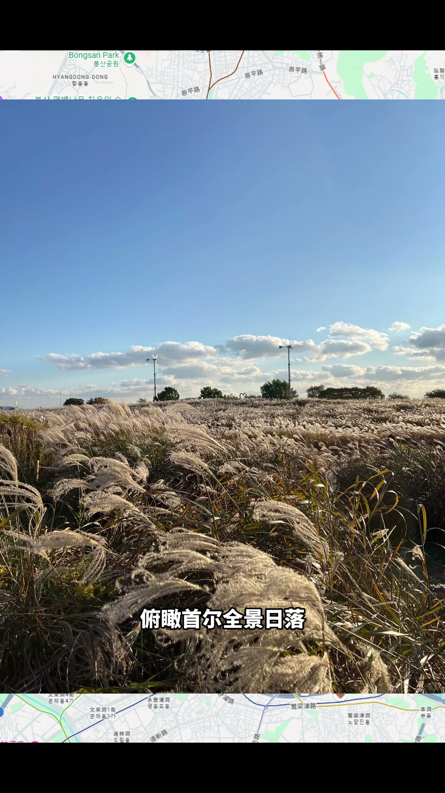

- **标签**：季节限定　·　**建议时长**：1.5h
- **为什么（针对你们）**：芒草季（约秋）很出片；过季就是普通山坡公园。10 月初可能赶上芒草前期，看当年长势。
- **Tips**：若去：安排半天+世界杯公园；不去也不亏。
- **更多截图**：`视频解析/景点/22-天空公园/`

---

### 崇礼门　★★★☆☆　`想去：[ ]`

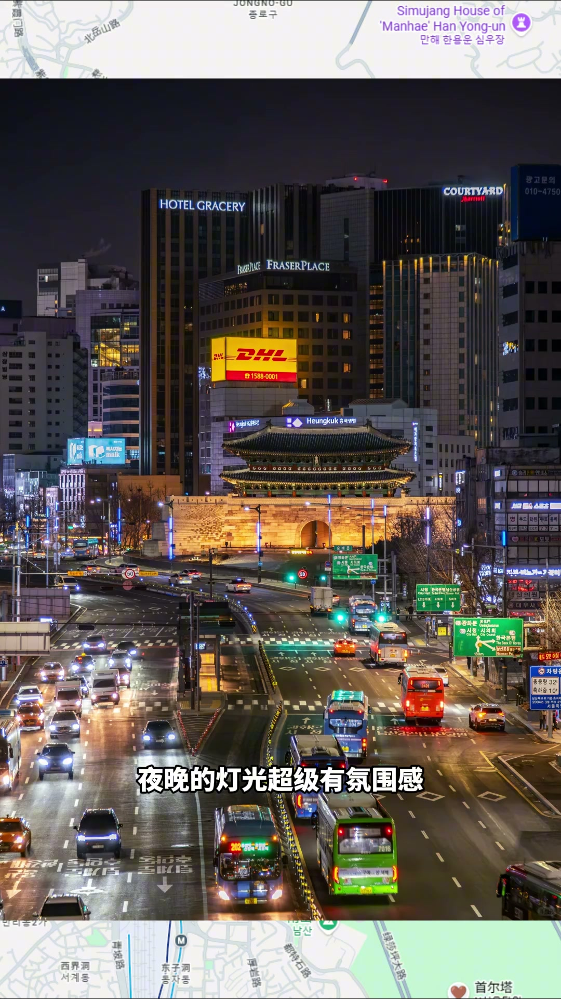

- **标签**：顺路看看　·　**建议时长**：15–30min
- **为什么（针对你们）**：国宝城门，灯光好看，但停十分钟够。别单独排半日。
- **Tips**：明洞/市厅路过打卡。
- **更多截图**：`视频解析/景点/15-崇礼门/`

---

### 延世大学　★★★☆☆　`想去：[ ]`

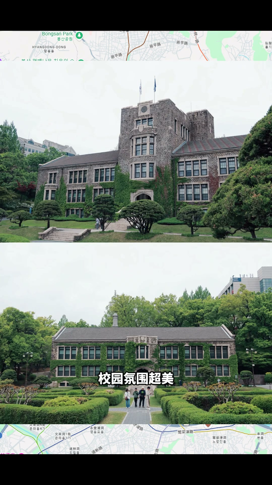

- **标签**：顺路可逛　·　**建议时长**：45–60min
- **为什么（针对你们）**：校园漂亮，新村商圈可吃。单独当景点略弱。
- **Tips**：和新村吃饭打包。
- **更多截图**：`视频解析/景点/19-延世大学/`

---

### 新沙洞林荫道　★★★☆☆　`想去：[ ]`

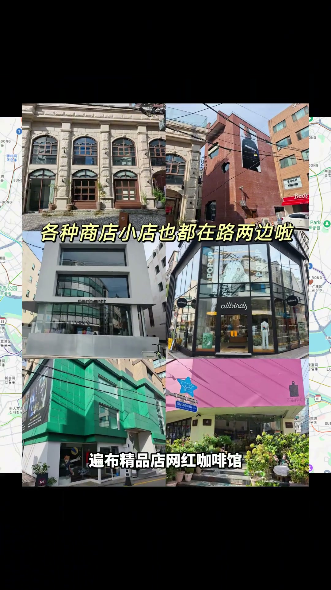

- **标签**：可选·散步　·　**建议时长**：1–1.5h
- **为什么（针对你们）**：林荫路好看、适合散步拍照，但店偏精致消费。时间够再去，别排在核心必去前面。
- **Tips**：可与狎鸥亭二选一，不必都去。
- **更多截图**：`视频解析/景点/10-新沙洞林荫道/`

---

### 明洞　★★★☆☆　`想去：[ ]`

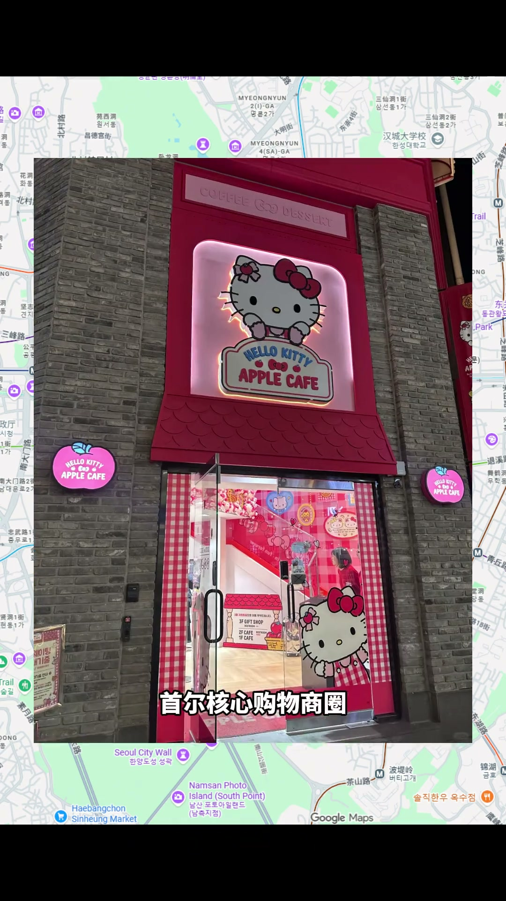

- **标签**：可选·购物　·　**建议时长**：1.5–2h
- **为什么（针对你们）**：美妆药妆方便，但小吃贵、游客雷区多。不是「好玩」第一名，是「好买」。穷游别把整天耗这。
- **Tips**：定好要买的清单再去；吃饭优先广藏/当地店。
- **更多截图**：`视频解析/景点/04-明洞/`

---

### 梨泰院　★★★☆☆　`想去：[ ]`

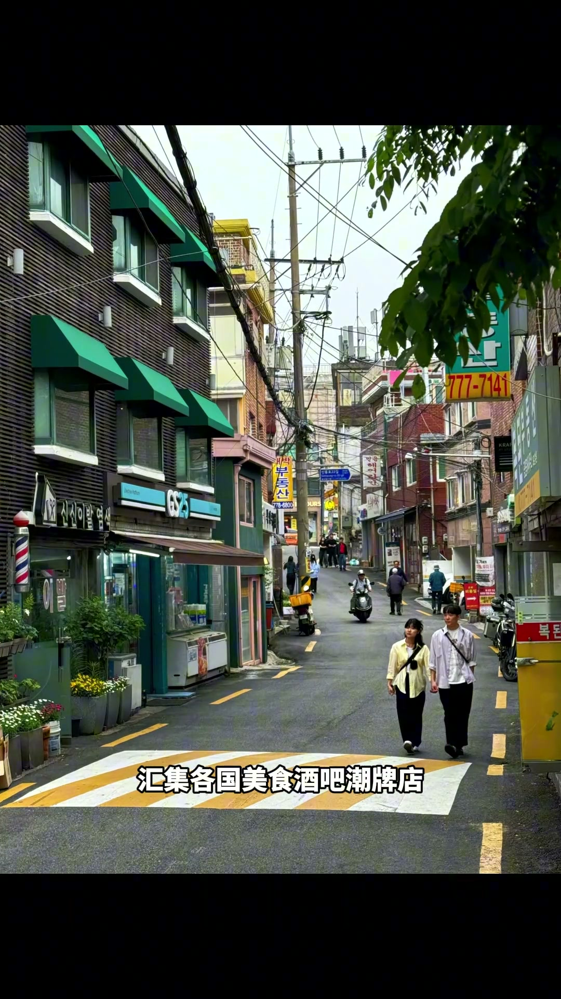

- **标签**：可选·晚餐　·　**建议时长**：夜2h
- **为什么（针对你们）**：国际餐吧多，氛围异国。对穷游偏贵；若想换口味吃一顿「略好」的晚餐可以。
- **Tips**：晚上去吃饭即可，白天可跳过。
- **更多截图**：`视频解析/景点/09-梨泰院/`

---

### 梨花女子大学　★★★☆☆　`想去：[ ]`

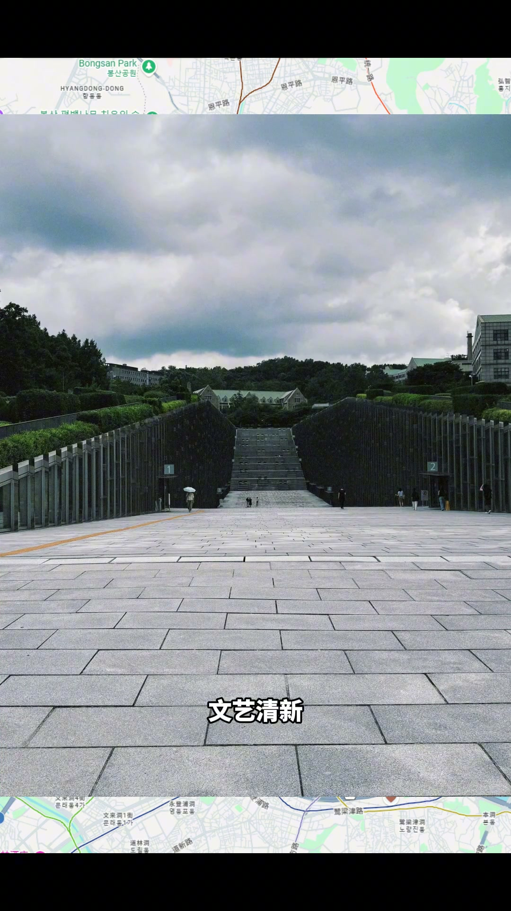

- **标签**：顺路可逛　·　**建议时长**：45–60min
- **为什么（针对你们）**：红砖楼和校园拍照清新，但就是校园。和弘大拼一天才值。
- **Tips**：别专程跨区只为进校门。
- **更多截图**：`视频解析/景点/18-梨花女子大学/`

---

### 首尔林　★★★☆☆　`想去：[ ]`

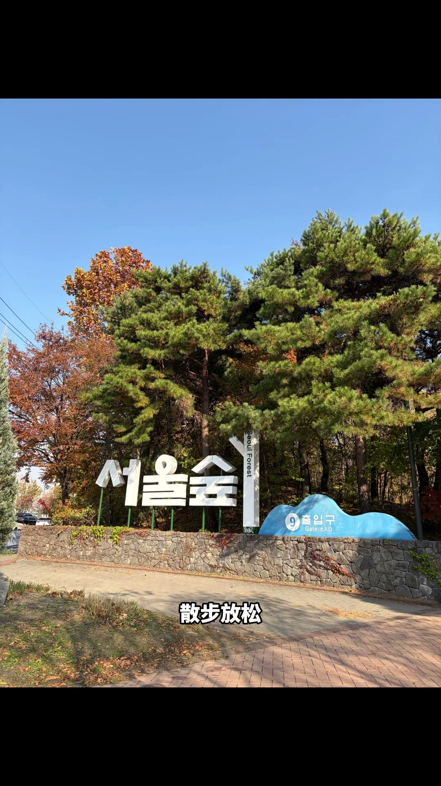

- **标签**：可选·公园　·　**建议时长**：1–1.5h
- **为什么（针对你们）**：大公园散步舒服、免费。和圣水连线有加成；单独专程一般。
- **Tips**：圣水日顺路进。
- **更多截图**：`视频解析/景点/24-首尔林/`

---

### 63大厦　★★☆☆☆　`想去：[ ]`

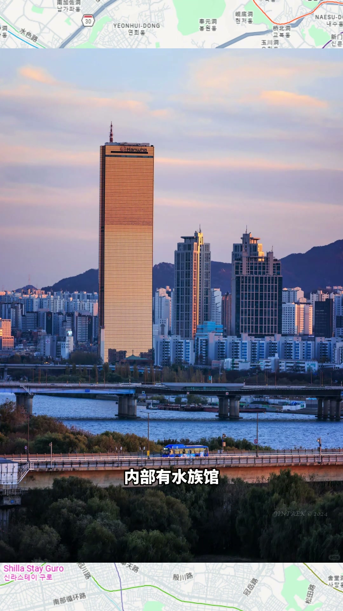

- **标签**：可跳过　·　**建议时长**：1–1.5h
- **为什么（针对你们）**：观景台+水族馆偏「观光套餐」，性价比一般。汉江公园免费版更划算。
- **Tips**：除非想去水族馆。
- **更多截图**：`视频解析/景点/34-63大厦/`

---

### 乐天世界游乐园　★★☆☆☆　`想去：[ ]`

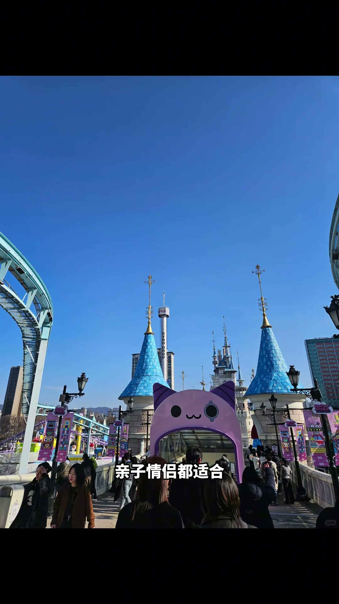

- **标签**：可跳过　·　**建议时长**：半天+
- **为什么（针对你们）**：好玩但极耗时间与预算，吃掉你们 1/3 行程。除非俩人都是乐园粉。
- **Tips**：短途默认不安排。
- **更多截图**：`视频解析/景点/30-乐天世界游乐园/`

---

### 建大中国街　★★☆☆☆　`想去：[ ]`

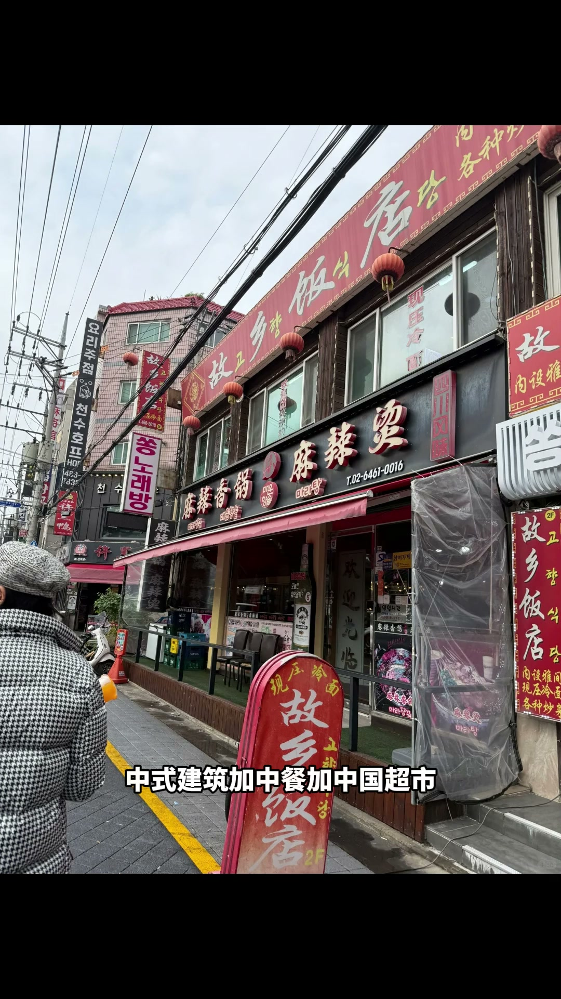

- **标签**：可跳过　·　**建议时长**：1h
- **为什么（针对你们）**：想家吃中餐可以，但专程去意义不大——你们从深圳出发，不必跑首尔吃中餐。
- **Tips**：除非特别想要熟悉味。
- **更多截图**：`视频解析/景点/26-建大中国街/`

---

### 汉阳大学　★★☆☆☆　`想去：[ ]`

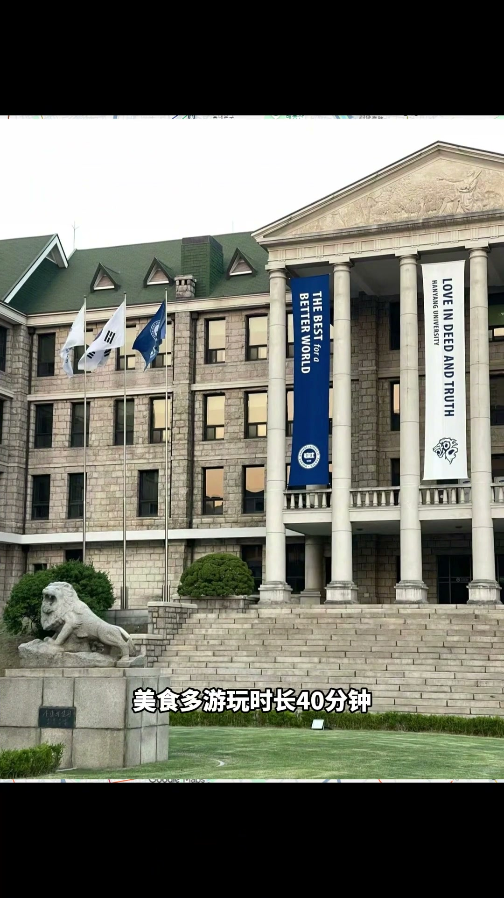

- **标签**：可跳过　·　**建议时长**：40min
- **为什么（针对你们）**：学生街能吃，但不够独特。圣水/弘大更值得。
- **Tips**：除非住附近。
- **更多截图**：`视频解析/景点/23-汉阳大学/`

---

### 江南站商圈　★★☆☆☆　`想去：[ ]`

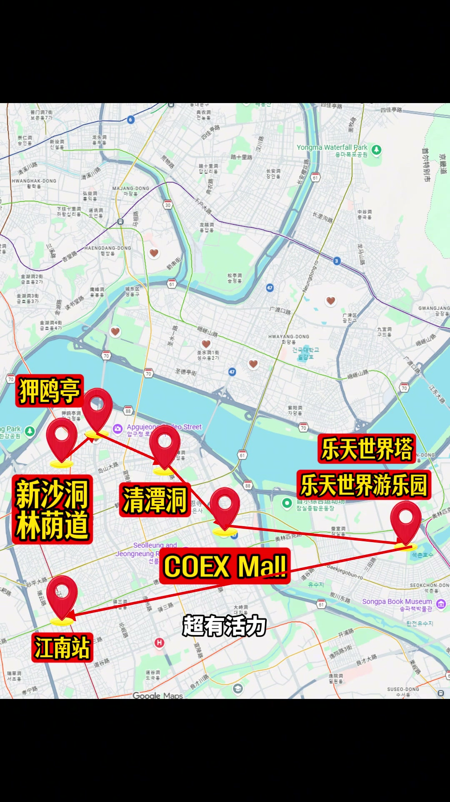

- **标签**：可跳过　·　**建议时长**：1–2h
- **为什么（针对你们）**：热闹但「国际大都市商圈」同质化，首尔特色不如弘大/北村。
- **Tips**：过路吃饭可以，不当目的地。
- **更多截图**：`视频解析/景点/32-江南站商圈/`

---

### 狎鸥亭　★★☆☆☆　`想去：[ ]`

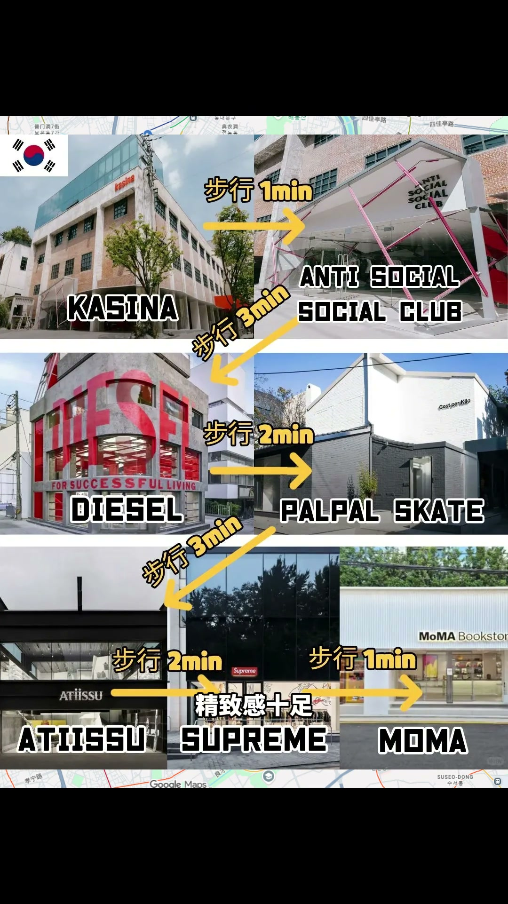

- **标签**：可跳过　·　**建议时长**：1h
- **为什么（针对你们）**：时尚街，消费高，和清潭洞、新沙重叠。穷游性价比差。
- **Tips**：新沙二选一即可。
- **更多截图**：`视频解析/景点/28-狎鸥亭/`

---

### 青瓦台　★★☆☆☆　`想去：[ ]`

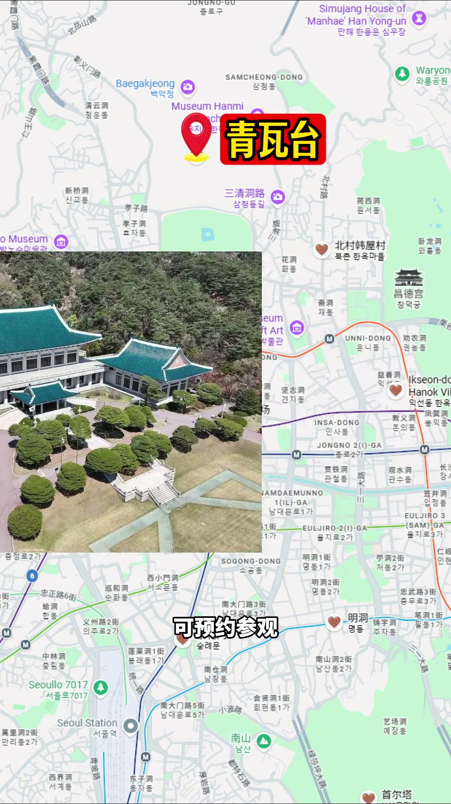

- **标签**：可跳过　·　**建议时长**：1h+预约
- **为什么（针对你们）**：有历史意义，但对短途情侣「好玩程度」一般，还要预约。2.5 天优先级低。
- **Tips**：除非特别想看总统府，否则留给下次。
- **更多截图**：`视频解析/景点/11-青瓦台/`

---

### 明知大学　★☆☆☆☆　`想去：[ ]`

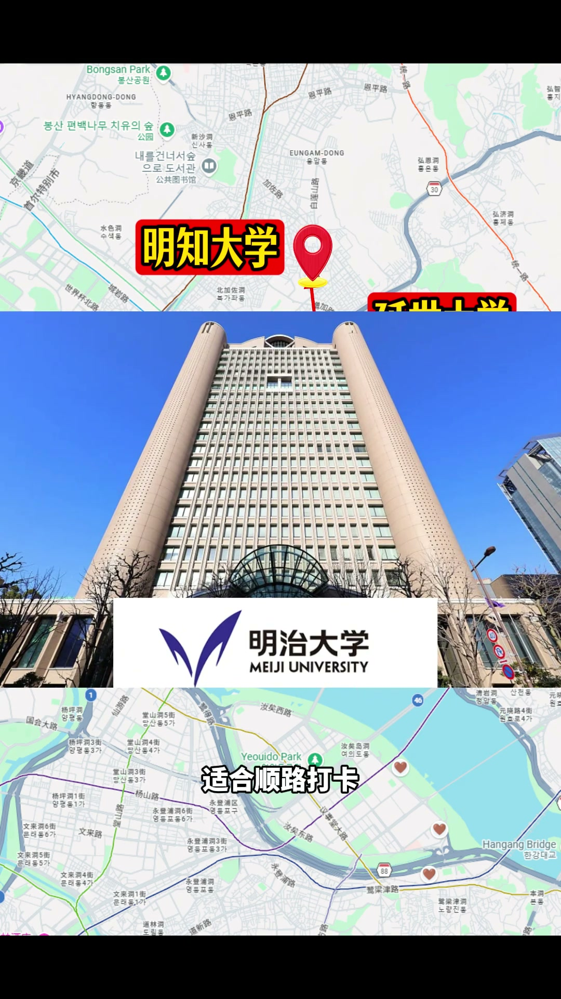

- **标签**：建议跳过　·　**建议时长**：40min
- **为什么（针对你们）**：短途性价比低，几乎纯校园。时间不够别去。
- **Tips**：直接删。
- **更多截图**：`视频解析/景点/21-明知大学/`

---

### 清潭洞　★☆☆☆☆　`想去：[ ]`

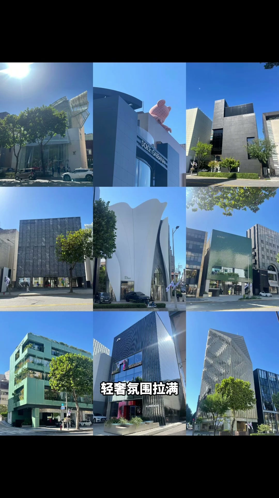

- **标签**：建议跳过　·　**建议时长**：1h
- **为什么（针对你们）**：奢侈品街，和预算风格不符。
- **Tips**：删。
- **更多截图**：`视频解析/景点/29-清潭洞/`

---

### 首尔儿童大公园　★☆☆☆☆　`想去：[ ]`

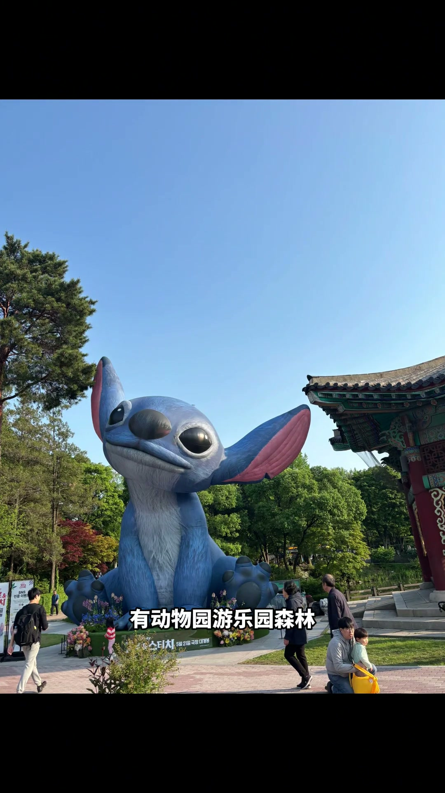

- **标签**：建议跳过　·　**建议时长**：2–3h
- **为什么（针对你们）**：亲子向。情侣短途不推荐。
- **Tips**：删。
- **更多截图**：`视频解析/景点/27-首尔儿童大公园/`

---

## 结合预算的「短名单」草案（未定稿）

| 优先级 | 景点 |
|--------|------|
| A 尽量去 | 景福宫、益善洞（或北村精简）、弘大、广藏市场、汝矣岛汉江日落 |
| B 二选一/看精力 | 东大门 DDP 夜景 **或** N塔/乐天塔；德寿宫夜景；圣水洞；鹭梁津海鲜 |
| C 替补 | 明洞购物清单游、COEX 避雨、梨泰院一顿饭、天空公园（若芒草好看） |
| D 这次不排 | 清潭洞、儿童大公园、明知大学、乐天乐园、建大中国街、63 大厦 |

勾完告诉我，再和酒店区位一起排最终日程。
